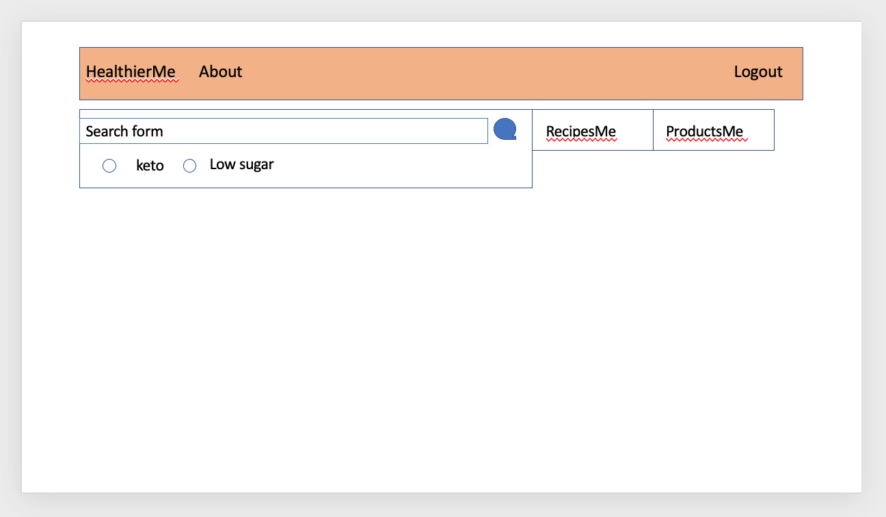
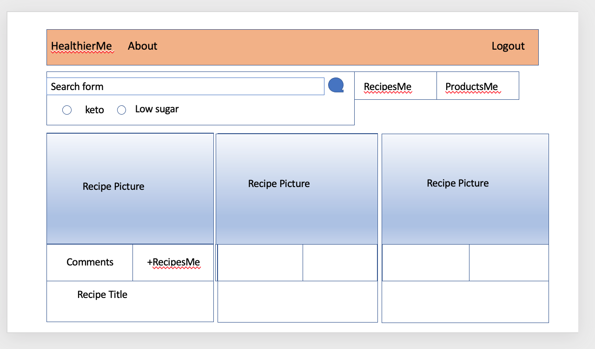
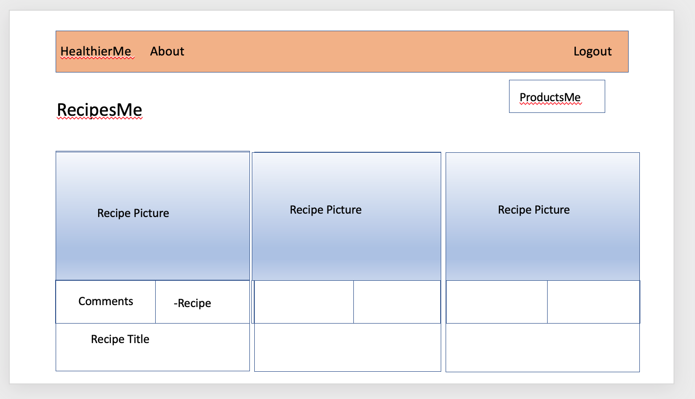
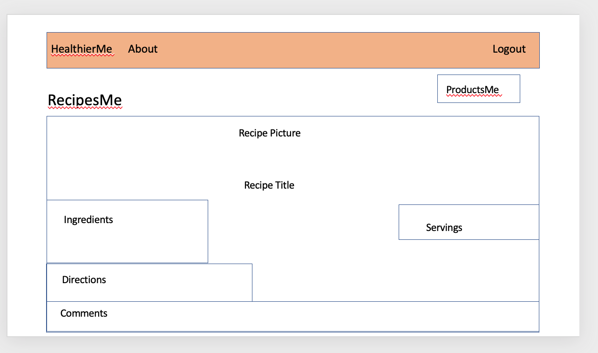
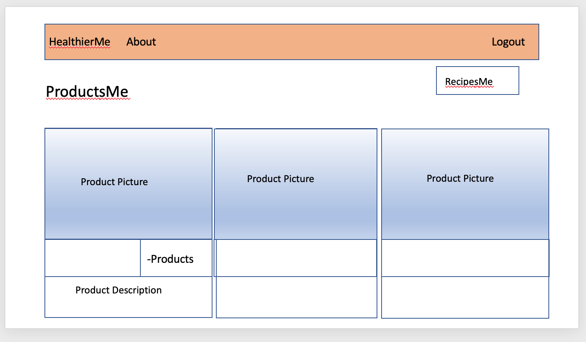

Healthier Me

# Description
Healthier Me is an app designed to allow users to search for healthier recipes
based on their dietary preferences.  Users can save recipes they have tried, rate them for ease of preparation, rate them for taste and add additional comments for how they modified the recipe or problems they encountered.  Users will also receive product recommendations for the recipe or dietary restrictions and can save product choices to their profile.

# MVP Goals
-Create a profile - signup/login
-Search for recipes based off of Preferences
-Save the recipes
-View the recipes
-Add Comments to the recipes
-View Other recipes 
-Add Other recipes
-View Recommended Products
-Add Recommended Products
-Delete your recipes
-Delete your recommendations

# Stretch Goals
- Allowing Users to add more specific nuturitional information or calorie searching
- Allowing Users to add Progress fitness/weight tracking to their profile
- Allowing Users to have a User Blog to track general notes for themselves.

# User Stories
- As a user, I want to be able to create a personalized account.
- As a user, I want to be able to track in my personalized account specific recipes according to my dietary preferences.
- As a user, I want to be able to track and save specific products and ingredients.
- As a user, I want to know which recipes I have tried and liked.
- As a user, I want to save and comment on recipes that I have tried
- As a user, I want to be able to see other users' comments of recipes
 -As a user, I want to be able to remove any recipes I did not like.

#APIs
[Edamam](https://developer.edamam.com/edamam-docs-recipe-api)
[OpenFood](https://world.openfoodfacts.org/data)
[Bootstrap](https://getbootstrap.com/)

# Wire Frames

## Home

## Search

## RecipesMe

## Recipe

## ProductsMe

# ERD
