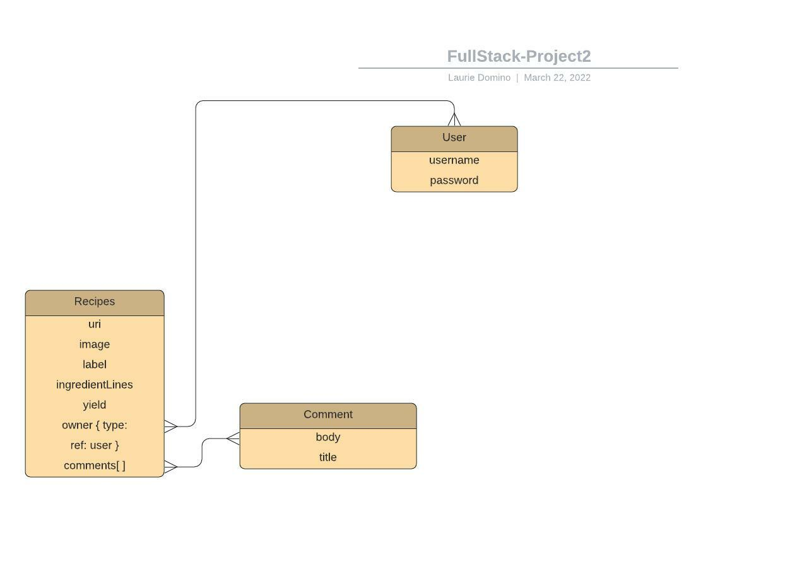

Healthier Me

# Description
Healthier Me is an app designed to allow users to search for healthier recipes
based on their dietary preferences.  Users can save recipes they have tried, rate them for ease of preparation, rate them for taste and add additional comments for how they modified the recipe or problems they encountered.  Users will also receive product recommendations for the recipe or dietary restrictions and can save product choices to their profile.

# MVP Goals
-Create a profile - signup/login
-Search for recipes based off of Preferences
-Save your MyRecipes
-View the search recipes
-View your MyRecipes
-Add Comments to MyRecipes
-Edit Comments to the MyRecipes
-Add Other MyRecipes
-Edit your MyRecipes
-View Recommended Articles
-Delete your MyRecipes
-Delete your Comments

# Stretch Goals
- Allowing Users to add more specific nuturitional information or calorie searching
- Allowing Users to add Progress fitness/weight tracking to their profile
- Allowing Users to have a User Blog to track general notes for themselves.
- Allowing Users to associate articles with a given MyRecipe
- Allowing Users to view Nutritional content for ingredient

# User Stories
- As a user, I want to be able to create a personalized account.
- As a user, I want to be able to track in my recipes according to my dietary preferences.
- As a user, I want to be able to track and save specific recipes and ingredients.
- As a user, I want to know which recipes I have tried and liked.
- As a user, I want to save and comment on my recipes that I have tried
- As a user, I want to edit and customize recipes and pictures.
 -As a user, I want to be able to remove any recipes I did not like.

#APIs
[Edamam](https://developer.edamam.com/edamam-docs-recipe-api)
[HealthFinder](https://health.gov/our-work/national-health-initiatives/health-literacy/consumer-health-content/free-web-content/apis-developers/how-use-api)
[Bootstrap](https://getbootstrap.com/)

# Wire Frames

## Home

## Search

## RecipesMe

## Recipe

## ProductsMe

# ERD

# Restful Routing API

| METHOD | URL                           | FUNCTIONALITY           | VIEW                           |
|--------|-------------------------------|-------------------------|--------------------------------|
| GET    | /                             | Home page               | render index.liquid            |
| GET    | /recipes                      | Search results          | render index.liquid            |
| GET    | /recipes/:id                  | Show a recipe           | renders recipes/show.liquid    |
| GET    | /recipes/mine                 | MyRecipes               | renders recipes/index.liquid   |
| GET    | /recipes/new                  | New Recipe              | renders recipes/new.liquid     |
| POST   | /recipes/new                  | Create Recipe           | redirect recipes/mine          |
| POST   | /recipes/:id                  | Add to MyRecipes        | redirect recipes?q=searchQuery |
| GET    | /recipes/:id/edit             | Edit a recipe           | render recipes/edit            |
| PUT    | /recipes/:id                  | Update a recipe         | redirect recipes/mine          |
| GET    | /recipes/mine/:id             | Show specific recipe    | renders recipes/show.liquid    |
| DELETE | /recipes/:id                  | Delete a recipe         | redirect recipes/mine          |
| GET    | /comment/:commentId           | Show a recipes comments | renders comment/index.liquid   |
| GET    | /comment/:id/:commentId       | Edit a specific comment | render comment/edit.liquid     |
| POST   | /comment/:id                  | Create a comment        | redirect comment/recipeId      |
| PATCH  | /comment/:id/:commentId/      | Update a comment        | redirect comment/recipeId      |
| DELETE | /comment/delete/:id/commentId | Delete a comment        | redirect comment/recipeId      |
| GET    | /signup                       | Sign up                 | render auth/signup.liquid      |
| POST   | /signup                       | Create user             | render auth/login.liquid       |
| GET    | /login                        | Sign in                 | render auth/login.liquid       |
| POST   | /login                        | Log in verification     | redirect /                     |
| GET    | /logout                       | Log out                 | redirect /                     |

# Home Page

# Edit Recipe/Comments

# SETTING UP INSTRUCTIONS

Setting up

You'll be using the Edamam Recipe Search API with two different API 
calls documented here:
[EDAMAM](https://developer.edamam.com/edamam-docs-recipe-api)

SignUp for a free Recipe search API KEY and USERID on the Edamam Website.
The HealthFinder website has no API KEY necessary to use.

-Fork and clone this repo.
-Copy the EDAMAM API KEY and USERID and keep track of it in your .env
file.
-Your .env file should be setup as follows for local testing:

`# database url is where our local db lives
DATABASE_URL=mongodb://127.0.0.1:27017/healthyme

# port is which local host to run this on
PORT=3000

SECRET=randomstring

# setup for API
EDAMAM_API_ID=id
EDAMAM_API_KEY=key`

-Test the url in browser to verify that your key and id works.
`https://api.edamam.com/search?q=${searchQ}&app_id=${apiId}&app_key=${apiKey}`

-cd into your cloned directory
-make sure you have mongodb installed and you have a working 
 mongodb server that you can start via brew services start mongodb-community@4.4 in a terminal window.

-To get everything setup propertly for development
`npm init or npm init -y` for a faster start up.  This will
allow you to customize the server name if you wish.

-Install the dependencies needed to run the server
`npm install`

-Once your env file has been modified, all node modules are installed,
 your mongodb server is up and running - you can start your server on your
 configured PORT (from your env file)

`npm start (will start your server)`
